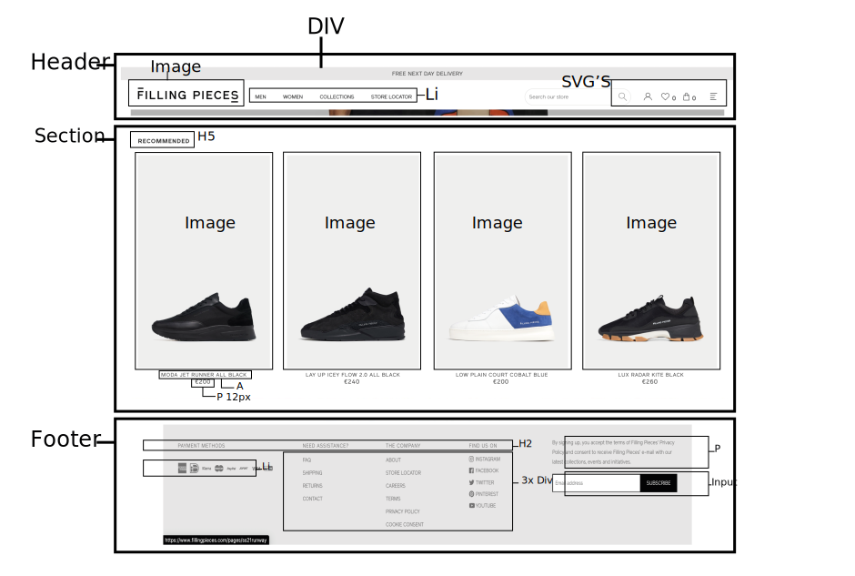

# Procesverslag
**Auteur:** -Noah Ubert-

Markdown cheat cheet: [Hulp bij het schrijven van Markdown](https://github.com/adam-p/markdown-here/wiki/Markdown-Cheatsheet). Nb. de standaardstructuur en de spartaanse opmaak zijn helemaal prima. Het gaat om de inhoud van je procesverslag. Besteedt de tijd voor pracht en praal aan je website.

## Bronnenlijst
1. https://www.w3schools.com/
2. Codepen (opdrachten van Sanne)
3. https://css-tricks.com/
4. Hamburger menu --> hulp van Ysabella Vargas
5. Footer --> Hulp van Sam Slotenmaker

## Eindgesprek (week 7/8) + Herkansing 

AANPASSINGEN HERKANSING 
Hey Joost,

Ik heb HTMl semantisch correct gemaakt (sections weggehaald en andere foute dingen), Ik heb extra Headings toegevoegd, ik heb ervoor gezorgd dat de twee buttons in mijn nav te bereiken zijn via de tab en dat het twee linkjes zijn en daarnaast heb ik de CSS aangepast, dus als het goed is ben ik nu helemaal klaar. 

De validators geven niks aan, behalve dat de scource van de foto's een spatie bevatten, maar ik hoorde van mijn klasgenootjes  dat dat niet zo erg was en dat zij dat ook hebben. Voor de rest heb ik geen errors meer!

Heel erg bedankt voor alle hulp en de goede lessen!

-dit ging goed & dit was lastig-
Ik ben erg tevreden over mijn werk. Ik vergelijk mijzelf niet met anderen, want ik doe het voor mezelf. Ik heb in de afgelopen tijd veel geleerd en grote stappen gemaakt. Natuurlijk zijn er verbeter punten, maar als ik zie waar ik begon (makkelijkste piste) ben ik erg blij. Morgen om 15:00 heb ik het gesprekje en dan gaan we zien wat de docent er van vindt.

**Screenshot(s):**

-screenshot(s) van je eindresultaat-  (

## Voortgang 3 (week 6)

Ik ben bijna klaar met mijn website. Enige waar ik op vastloop is de navigatie en de footer (responsive maken). Inprincipe heb ik ze beiden al op mobieleversie, alleen moet ik er nu nog voor zorgen dat ze beiden ook mooi zijn op webversie. Daarnaast ben ik ook begonnen aan Javascrip, dit gaat tot nu toe goed af. Ik denk echter wel dat het me veel moeite gaat kosten om de nav en footer te fixene. Wanneer ik dit klaar heb wil ik extra dingen toevoegen en verbeteren.

## Voortgang 2 (week 5)
Week 5 ging goed. Ik loop goed op schema en de dingen die ik wil doen lukken. Ik merk wel dat ik nog steeds chaotisch werk en soms van hot naar her ga. Het fijne is dat ik het zelf door heb dus er iets aan kan doen. Ondanks dat heb ik wel een goed begin kunnen maken aan mijn tweedepagina. Ik heb alle items kunnen plaatsen m.b.v. een grid.  Met een mediaquery heb ik hem van 4 op desktop, naar 2 op mobiel kunnen brengen waardoor het in 1 keer snel en mooi responsive is.

## Voortgang 1 (week 3)
Deze week ging niet heel lekker. Ik zag het overzicht niet meer en zat met mijn handen door mijn haren. Gelukkig heb ik goed gebruik kunnen maken van de studentencoach (Sam). Sam heeft me de goede richting geduwd waardoor ik weer erg positief was over mijn eind-opdracht.

### Stand van zaken

-dit ging goed & dit was lastig-
Aan het begin vond ik het positioneren van alle content erg lastig. Achteraf merkte ik dat het steeds beter ging. De opdrachten van Sanne hebben hierbij erg geholpen (grid, positioneren, javascript). Echter merk ik wel dat ik mijn code kan versimpelen (korter). Daarnaast heb ik soms nog moeite met wat nou precies Semantisch correct is en wat niet. 

**Screenshot(s):**

-screenshot(s) van hoe ver je bent-

### Agenda voor meeting

-samen met je groepje opstellen-

### Verslag van meeting

-na afloop snel uitkomsten vastleggen-

## Intake (week 1)

**Je startniveau:** Ik heb gekoze voor de blauwe piste. Ik vind coderen moeilijk en kost me veel moeite. Echter vind ik het wel interessant en leuk als het eenmaal goed gaat. Ik moet eerst echt op gang komen voordat het een beetje goed gaat. Ik hoop dat ik door middel van dit vak een piste omhoog kan.

**Je focus:** -kies uit responsive óf surface plane-
Mijn focus ligt op Responsive.

**Je opdracht:** -link naar de website die je gaat namaken óf de naam van je eigen ontwerp-
https://www.fillingpieces.com/

**Screenshot(s):**

**Breakdown-schets(en):**

